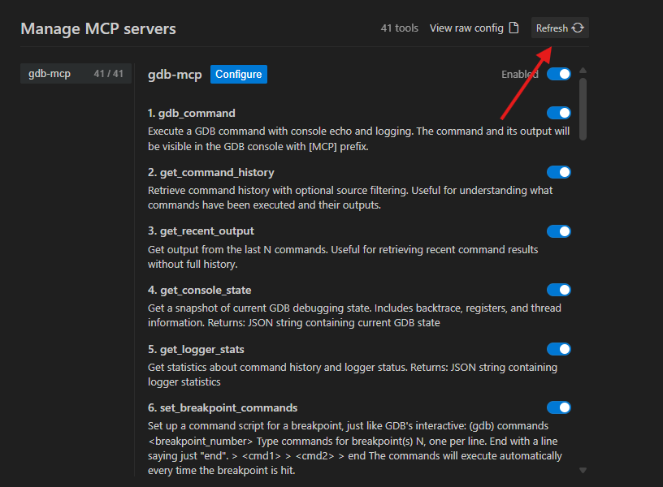
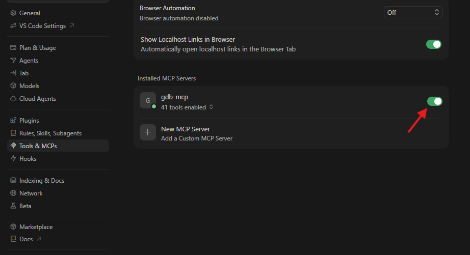
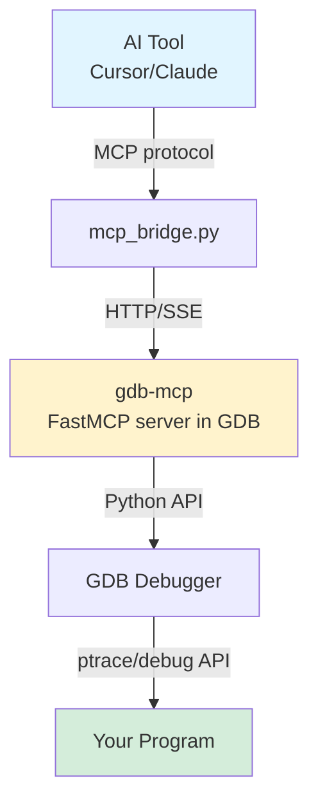

# GDB MCP Server

<p align="center">
  <strong>Bridge GDB and AI assistants through Model Context Protocol</strong><br>
  Debug collaboratively with full transparency—see what your AI is doing, and let it see what you're doing.
</p>

<p align="center">
  <a href="#features">Features</a> •
  <a href="#installation">Installation</a> •
  <a href="#usage">Usage</a> •
  <a href="#troubleshooting">Troubleshooting</a> •
  <a href="#architecture">Architecture</a>
</p>

---

> [!NOTE]
> **What makes this different**: Unlike typical MCP servers that operate invisibly, this one mirrors all AI commands to your console with `[MCP]` tags. Both you and the AI share the same GDB session with complete mutual visibility.

## Features

<table>
<tr>
<td width="33%" valign="top">

### 🔄 Transparent Collaboration
- Screen mirroring: All MCP commands echo to console
- Command history: AI sees your manual GDB commands
- Source attribution: USER/MCP/SYSTEM tags
- Real-time synchronization: No hidden state

</td>
<td width="33%" valign="top">

### ⚡ Complete GDB Control
**30+ MCP tools**
- Breakpoint management with command scripts
- Thread and frame navigation
- Memory and register inspection/modification
- Execution control (step, continue, finish, until)
- Watchpoints, catchpoints, and conditionals

</td>
<td width="33%" valign="top">

### 🎯 Smart Output Handling
- Automatic output capture via GDB's prompt hook
- Large output truncation (>100KB)
- Configurable command history limits
- Console state snapshots on demand

</td>
</tr>
</table>

---

## Quick Start

```bash
# 1. Add to ~/.gdbinit
echo "source $HOME/path/to/gdb-mcp/gdb-mcp" >> ~/.gdbinit

# 2. Install FastMCP
pip install fastmcp

# 3. Start GDB and enable MCP
gdb ./your-program
(gdb) mcp-server 127.0.0.1 3333

# 4. Configure your AI tool (see below) and start debugging!
```

---

## Installation

<details open>
<summary><b>1️⃣ Setup GDB Integration</b></summary>

<br>

Add to your `~/.gdbinit`:

```bash
echo "source $HOME/path/to/gdb-mcp/gdb-mcp" >> ~/.gdbinit
```

Replace `path/to/gdb-mcp` with the actual directory where you cloned this repository.

</details>

<details open>
<summary><b>2️⃣ Start MCP Server in GDB</b></summary>

<br>

Launch GDB and run:
```gdb
(gdb) mcp-server 127.0.0.1 3333
```

You should see:
```
[mcp] Command logger initialized (history size: 1000)
[mcp] Prompt-hook output capture installed — user commands + outputs will be captured
[mcp] Starting SSE server on 127.0.0.1:3333...
[mcp] Screen mirroring enabled - MCP commands will be visible in console
[mcp] Server launched in background.
```

</details>

<details open>
<summary><b>3️⃣ Configure Your AI Tool</b></summary>

<br>

**Cursor / Antigravity / Claude Desktop**

Add to `~/.config/cursor/mcp_config.json`:

```json
{
    "mcpServers": {
        "gdb-mcp": {
            "command": "python3",
            "args": ["/path/to/gdb-mcp/mcp_bridge.py"]
        }
    }
}
```

**Cline (VS Code)**

Add to `.vscode/settings.json`:

```json
{
    "mcp.servers": {
        "gdb-mcp": {
            "command": "python3",
            "args": ["/path/to/gdb-mcp/mcp_bridge.py"]
        }
    }
}
```

</details>

---

## Usage

### 🚀 Basic Workflow

```bash
# Start your debug session
gdb ./your-program

# Enable MCP server
(gdb) mcp-server 127.0.0.1 3333

# Connect from your AI tool and start debugging!
```

**Ask your AI assistant to help debug:**
- "Set a breakpoint at main and run"
- "Show me the backtrace and local variables"  
- "Step through this function and watch variable x"
- "Read memory at address 0x7fff5000"

### 🤝 User + AI Collaboration

Both you and the AI can control GDB simultaneously:

| Action | What Happens |
|--------|--------------|
| **You type:** `(gdb) break foo` | Your command executes normally |
| **AI can see:** | Your command appears in history |
| **AI types:** `gdb_command("info breakpoints")` | Console shows: `[MCP] info breakpoints` + output |
| **You see:** | Everything the AI is doing in real-time |

### 🛠️ Available MCP Tools

<details>
<summary>Check available tools in GDB</summary>

```gdb
(gdb) mcp-status
```

</details>

**Key tools include:**

| Tool | Description |
|------|-------------|
| `gdb_command(command)` | Execute any GDB command |
| `gdb_run_script(commands)` | Run multi-line scripts |
| `get_command_history(limit, source)` | View command history |
| `get_console_state()` | Get current debugging state |
| `gdb_set_breakpoint(location)` | Set breakpoints |
| `set_breakpoint_commands(bp_num, commands)` | Attach command scripts |
| `gdb_evaluate_expression(expr)` | Evaluate expressions |
| `gdb_read_memory(addr, count)` | Read memory |

<sub>And 20+ more...</sub>

---

## Troubleshooting

<details>
<summary><b>❌ MCP Fails to Initialize After GDB Crash</b></summary>

<br>

**Symptoms:** After GDB crashes while MCP server was running, subsequent MCP commands fail to connect or initialize properly.

**Cause:** Stale server state or connection remnants from the crashed session.

**Solutions:**

1. **Refresh the MCP connection** (Recommended)
   
   | Tool | Action |
   |------|--------|
   | **Antigravity** | Click the refresh button  |
   | **Cursor** | Use the disable/enable toggle  |
   | **Claude Desktop** | Restart the application |

2. **Restart GDB**
   ```bash
   # Kill any stray processes
   pkill -f "mcp-server"
   
   # Start fresh GDB session
   gdb ./your-program
   (gdb) mcp-server 127.0.0.1 3333
   ```

3. **Check for port conflicts**
   ```bash
   # See if port 3333 is still in use
   lsof -i :3333
   
   # If needed, use a different port
   (gdb) mcp-server 127.0.0.1 3334
   ```

</details>

<details>
<summary><b>⚠️ Large Output Hangs AI</b></summary>

<br>

The server automatically truncates large outputs (>100KB per command) with a message indicating truncated bytes. 

If issues persist:

```python
# Get just recent output
get_recent_output(count=1)

# Limit history results
get_command_history(limit=10)
```

</details>

<details>
<summary><b>🔍 Commands Not Showing in History</b></summary>

<br>

Ensure the prompt hook is installed:

```gdb
(gdb) mcp-status
```

Should show:
```
User Command Capture: Installed (prompt_hook)
```

> [!TIP]
> If not showing, restart GDB or check for `.gdbinit` issues.

</details>

---

## Architecture

### Components

<table>
<tr>
<td width="50%">

**`gdb-mcp`** — GDB Python script
- Installs prompt hook for output capture
- Runs FastMCP SSE server in background thread
- Provides 30+ MCP tools for GDB control

</td>
<td width="50%">

**`mcp_bridge.py`** — External MCP client
- Connects to the GDB SSE server
- Translates between MCP protocol and GDB commands
- Used by AI tools to communicate with GDB

</td>
</tr>
</table>

### How It Works



<details>
<summary>Alternative text-based diagram</summary>

```
AI Tool (Cursor/Claude)
    ↓ (MCP protocol)
mcp_bridge.py
    ↓ (HTTP/SSE)
gdb-mcp (FastMCP server running in GDB)
    ↓ (Python API)
GDB Debugger
    ↓ (ptrace/debug API)
Your Program
```

</details>

---

## Requirements

| Requirement | Notes |
|------------|-------|
| **GDB with Python support** | Most modern GDB installations |
| **Python 3.7+** | Required for FastMCP |
| **FastMCP library** | Install: `pip install fastmcp` |
| **AI tool with MCP support** | Cursor, Claude Desktop, Cline, etc. |

---

## Contributing

Contributions welcome! 🎉

**Areas for improvement:**
- Better error recovery from GDB crashes
- Support for remote debugging targets
- Enhanced output formatting
- Additional debugging tools

---

## Credits

Built on [FastMCP](https://github.com/jlowin/fastmcp) for the MCP server implementation.

<p align="center">
  <sub>Made with ❤️ for collaborative debugging</sub>
</p>
